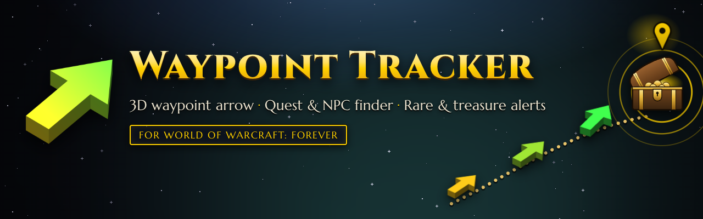
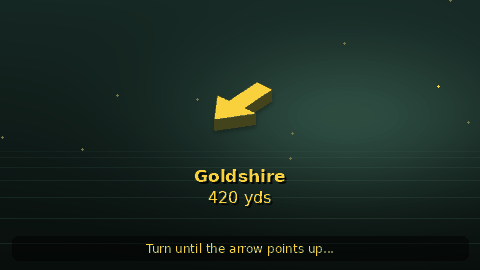
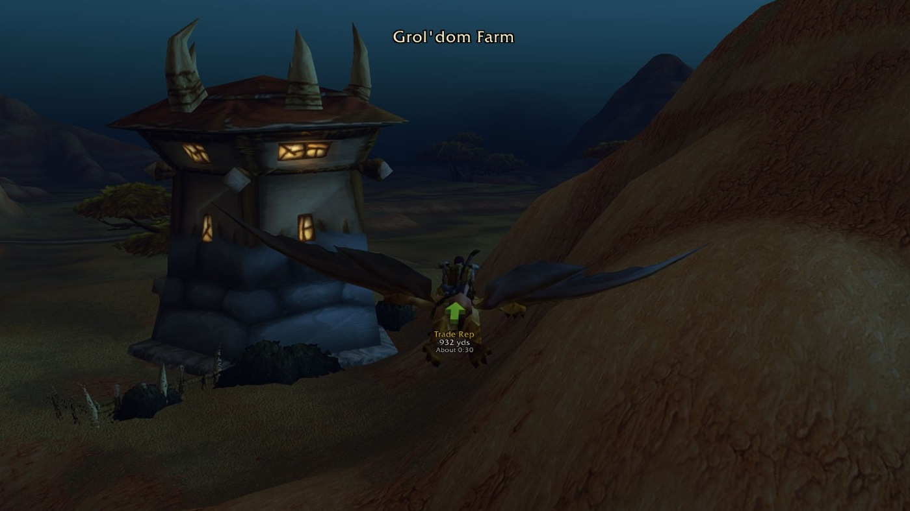
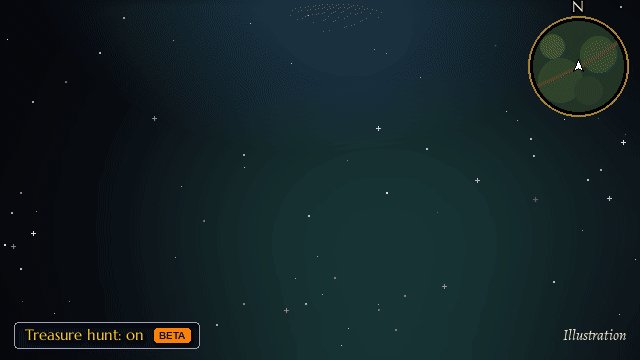
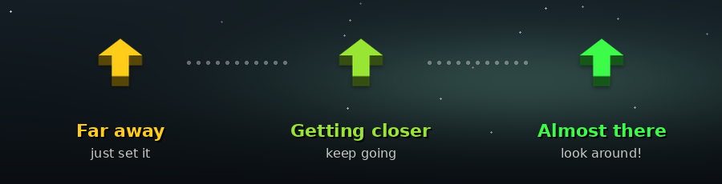

<p align="center">
  
</p>

<h1 align="center">Waypoint Tracker: the 3D waypoint arrow and quest finder for WoW Forever</h1>

<p align="center">
  
  
  
  
  
  <a href="https://github.com/sponsors/sanjaygbhat"></a>
</p>

<p align="center">
  <b>Set a waypoint. Follow the arrow. That's it.</b><br>
  <a href="#-screenshots">Screenshots</a> ·
  <a href="#-treasure-hunt-beta">Treasure hunt</a> ·
  <a href="#-install">Install</a> ·
  <a href="#-ways-to-set-a-waypoint">Set a waypoint</a> ·
  <a href="#-the-arrow-talks-in-colours">Colours</a> ·
  <a href="#%EF%B8%8F-settings">Settings</a> ·
  <a href="#-chat-commands">Commands</a> ·
  <a href="#-faq">FAQ</a>
</p>

**Waypoint Tracker** is a free, open-source addon for **World of Warcraft: Forever** (WoW Forever, the new classic-style World of Warcraft, sometimes called Classic+). A 3D arrow over your character points to your waypoint, shows the distance and time to arrive, turns from gold to green as you get close, and clears itself when you arrive. Set waypoints from coordinates (`/way 42 65`), the world map, or by name: the built-in **Find** tab searches quests, NPCs, enemies, objects and items, including WoW Forever's new content. Share any spot in chat as a clickable map pin.

It's a TomTom-style arrow and a quest and NPC finder in one addon, with nothing to configure.

Open `/wp` or left-click the minimap button for one window with **Waypoints**, **Find** and **Routes** tabs. Editors, imports and help stay inside the tabs; **Back** returns to the previous page. Feedback appears below the title, above the tab content. Right-click the minimap button for the quick menu; Shift + left-click adds a waypoint where you stand. The Addon Compartment also opens the window or quick menu.

| | |
|---|---|
| **Game** | World of Warcraft: Forever (client 1.60.1, interface 16001) |
| **Price** | Free, MIT licence, no ads |
| **Get it** | [CurseForge](https://www.curseforge.com/wow/addons/waypoint-tracker), [Wago](https://addons.wago.io/addons/waypoint-tracker) or [GitHub Releases](https://github.com/sanjaygbhat/wowforever-waypoint-tracker/releases/latest) |
| **Website** | [sanjaygbhat.github.io/wowforever-waypoint-tracker](https://sanjaygbhat.github.io/wowforever-waypoint-tracker/) |
| **Commands** | `/wp` (window), `/way` (coordinates or a name), `/wp find`, `/wp treasure`, `/wp share` |
| **Works with** | Quest guides, rare and treasure trackers, and anything with a "Send to TomTom" button |
| **Languages** | English, German, French, Spanish, Portuguese, Russian, Korean, Simplified and Traditional Chinese |

---

## 📜 Quest: Find Your Way

> **Quest giver:** every adventurer who has ever run in circles looking for a quest mob
>
> *"You there! You've got coordinates from a guide, a guildmate or a map, and no idea which way to run. Take this arrow. It points where you need to go and turns green when you're close. Nothing else to learn."*

**Objectives**

- [ ] Set a waypoint: open the window with `/wp`, or just type `/way 42 65`
- [ ] Follow the arrow until it turns **green**
- [ ] Arrive. The waypoint clears itself and the arrow moves on to the next one.

<p align="center">
  
</p>

**Rewards**


---

## ✨ Why players like it

- **Set a waypoint your way:** a small window, `/way`, a quest or place name, the Find tab, or Ctrl + Right-click on the map.
- **An arrow that tells you how close you are:** gold far away, green as you get there. It never catches mouse clicks, so right-click to attack always works.
- **One window:** Waypoints, Find and Routes tabs, with settings in Blizzard Settings and placement in Edit Mode.
- **Typing is forgiving:** pick zones from a list that filters as you type. Typos, accents and capital letters don't matter, and pasted coordinates like `45.2 67.8` or `45,2 67,8` work in the Add box.
- **Find built in:** quests, NPCs, enemies, objects, items and places, including WoW Forever's new content, plus a Nearest menu for services.
- **Share in one click:** send any spot, or where you are, to chat with a clickable map pin, without setting a waypoint first.
- **Treasure hunt (beta):** a ping when a chest or rare appears near you, and the arrow points at it.
- **Works with your other addons:** quest guides and anything with a "Send to TomTom" button put their waypoints on this arrow.
- **Built for WoW Forever:** interface 16001, the game's Edit Mode, and nine languages.

---

## 📸 Screenshots

<p align="center">
  
  <br><sub>The arrow on the way to a waypoint in the Barrens, with its name, distance and time to arrive.</sub>
</p>

TODO: refresh the screenshots for this release:

- Waypoints tab with the Add row and feedback below the title.
- Find tab with the kind dropdown and Nearest menu.
- Routes tab and an editor page with Back.
- Blizzard Settings and Edit Mode with all four HUD elements.

The existing map screenshot is in [docs/screenshots](docs/screenshots/README.md). The old window capture needs replacing.

---

## 💎 Treasure hunt (beta)

<p align="center">
  
  <br><sub>Treasure hunt, illustrated with the addon's own arrow.</sub>
</p>

New in 1.1 and still in beta: tell us what it catches and what it misses in [Issues](../../issues). Turn on **Treasure hunt (beta)** in Settings or the quick menu (or type `/wp treasure`, or set a key binding) and Waypoint Tracker watches for loot around you:

- **Chests and treasure** the game marks on your minimap, and a chest right in front of you.
- **Rare spawns:** rare and rare elite enemies on your minimap, nameplates or target, placed at their known spawn. Ones someone else is already fighting are left out.
- **Events and other markers** the game shows on your minimap.

The moment one appears you hear a ping and see it on screen, and the taskbar icon blinks if you're in another window. The arrow points at it right away, follows a rare that wanders, and lets it go once it's taken, killed or gone, then goes back to your own waypoint.

Turn on **Lead me to known chest spots** and, while nothing has appeared, the arrow walks you from one known chest spawn to the next. Each part has its own switch under **Settings → Treasure Hunt (beta)**.

---

## 📦 Install

**CurseForge app (easiest):** search for **Waypoint Tracker**, choose the **Forever** game version, click *Install*. Or open the [CurseForge page](https://www.curseforge.com/wow/addons/waypoint-tracker).

**Wago:** install it from [addons.wago.io](https://addons.wago.io/addons/waypoint-tracker).

**By hand:**

1. Download the latest `WaypointTracker-vX.Y.Z.zip` from [Releases](https://github.com/sanjaygbhat/wowforever-waypoint-tracker/releases/latest).
2. Unzip it into your AddOns folder. You should get **two** folders: `...\Interface\AddOns\WaypointTracker\` and `...\Interface\AddOns\WaypointTracker_Data\` (the database for the Find tab).
   - WoW Forever beta: `World of Warcraft\_classic_beta_\Interface\AddOns\`
3. Restart the game, or type `/reload` if it's already running.

> [!TIP]
> Downloading this repository as a zip also works: copy the inner `WaypointTracker` and `WaypointTracker_Data` folders into AddOns.

---

## 🧭 Ways to set a waypoint

| How | Good for |
|---|---|
| **Waypoints tab:** type a zone, place or coordinates like `42 65` in the Add box; add an optional name and press **Set**. Pick a zone first for coordinates in another zone. | Coordinates from a guide or a place name |
| **Find tab:** search, filter by kind and double-click a result or press **Take Me There**. The **Nearest** menu finds services. | Quests, NPCs, enemies, objects and items |
| **Chat:** `/way 42 65`, `/way Westfall 56.3 47.1 Sentinel Hill`, or `/way hogger`. | Quick waypoints and macros |
| **World map:** hold Ctrl and right-click a spot. Click a waypoint pin to point the arrow there; Alt-click removes it. | A destination you can see on the map |
| **Here:** press **Here** in Waypoints, Shift + left-click the minimap button, or use **Add waypoint here** in the quick menu. | Marking where you stand |

Click a waypoint row to point the arrow there. Right-click it to share or remove it. To share typed coordinates without setting a waypoint, right-click **Set**; `/wp share` shares where you stand. Pick a chat channel and press Enter to send the clickable map pin. The **[Waypoint Tracker]** prefix can be turned off in **Settings → Find & Sharing**.

Move the arrow, its text, the coordinates box and the route recorder in **Esc → Edit Mode**. Each layout keeps its own positions. **Reset to Default** restores the selected element. Enable **Move the text separately** to place the text independently. The arrow ignores mouse clicks during play.

When you die, the arrow can point to your corpse and return to your waypoint when you're alive. A waypoint set where you stand waits until you've walked away before it counts as reached. The arrow can also follow the game's map pins and pin links clicked in chat.

---

## 🔍 Find any quest, NPC, enemy or object

Open the **Find** tab (or type `/wp find`, or set a key binding):

- **Search** thousands of NPCs, quests, objects and quest items as you type. Small typos are fine.
- The **kind dropdown** narrows it down: All, Quests, NPCs, Enemies, Objects, Items. **NPCs** are the friendly ones (vendors, trainers, quest givers); **Enemies** are the mobs you fight, with level and elite/rare/boss; **Objects** are herbs, ore, chests and quest objects. **All** also finds flight paths and towns. **Only my faction** and **Only this zone** filter the list.
- **Click** a result to see where it is. **Double-click** it (or press **Take Me There**) and the arrow points to the **closest** spawn.
- **Quests** show whether you have them, who gives them and who you hand them in to, with buttons for **Go to Quest Giver**, **Go to Objective** and **Go to Hand In**. For quest items it knows who drops or sells them.
- The **Nearest** menu finds the closest **Mailbox**, **Innkeeper**, **Flight Master**, **Repair**, **Bank** or **Auction House** for your faction.

Find shows its double-click tip once per session below the title. The footer shows quest-name scan progress only while that scan runs.

The database is a separate folder, `WaypointTracker_Data`, and only loads the first time you open Find, so it costs nothing while you play.

### 🧾 Where the data comes from: the game always wins

WoW Forever adds new zones (Mount Hyjal, Riverglades, Zephras Isle, Shen'dralas...) and keeps Season of Discovery content: about 3,000 quests and 6,600 items beyond the classic world. Find combines a curated WoW Forever database, the WoW Forever game files and what players see in the game. When two disagree, the higher one wins:

| | Source | What it gives |
|---|---|---|
| 1️⃣ | **What you see in the game** | While you play, the addon writes down the NPCs and enemies around you (from their nameplates, your target and what you point at) with their title, like *Blacksmith*, and where they stand; what each vendor sells; the quest givers you talk to and where you hand quests in; the objective areas the game marks on your map; what each quest in your log asks for; which enemy or object drops each item you loot; the services NPCs offer (vendor, trainer, flight master, repair, bank...); and mailboxes. Find uses it right away. An NPC who stands somewhere new gets your spot in place of the old one, and enemies you see add to their known spawns. Friendly nameplates (**Shift+V**) let it notice even more NPCs. |
| 2️⃣ | **Other players' discoveries** | Shared by players (see below) and shipped with each update. |
| 3️⃣ | **The shipped database** | Quest givers and where they stand, NPCs, enemies, objects, flight masters and what drops or sells what, from a curated WoW Forever database, with Season of Discovery data for the quests WoW Forever kept, on top of the classic world. Plus every item, flight path, town and quest map marker in the WoW Forever game files, in all nine languages. The addon learns the names of Forever's new quests from the game a few at a time while you play, and after about ten minutes they're all searchable in your language. WoW Forever reshaped four maps (Stormwind with its harbour, Mulgore, Redridge Mountains and the Eastern Plaguelands), and spots there are placed on Forever's maps. |

What you and other players found that the database didn't have is marked in blue in the details pane ("Discovered by you", "Shared by other players"). Search an NPC's title too: **blacksmith** finds the blacksmiths you've seen. Learning runs once a second outside combat and takes a handful of quick checks. Your discoveries keep only what's new or different from the database, so they stay small, and they stay on your computer: nothing is ever sent anywhere unless you choose to share it. You can turn learning off in **Settings → Find & Sharing**.

### ✏️ Correct a spot

Found an NPC or object somewhere other than where Find says? Select it in Find and press **Wrong Spot? Correct It**. Stand where it really is and press **Use My Position** (or type its coordinates), then **Save Correction**. Find uses your spot right away. **It's Not There** removes a spot that's wrong, and **Remove My Correction** undoes it. Something with no spot at all shows **Add Where It Is** instead. Corrections are saved on your computer and included when you share your discoveries.

### 🤝 Share what you find

Found something new? Your discoveries make Find better for everyone:

1. Open **Find** and choose **Share discoveries** from the **Discoveries** menu. The text is already selected, so press **Ctrl+C**. It holds only what the database doesn't have yet, plus your corrections, so it stays short.
2. [Open a "Share discoveries" issue](../../issues/new?template=discoveries.yml) and paste it with **Ctrl+V**. Add a note if you like.
3. What adds to the database goes into a coming update. The newest sightings always win.

Played a lot? Attach your saved file to the issue instead: `WTF/Account/<your account>/SavedVariables/WaypointTracker.lua` in your WoW Forever folder (close the game first). It holds everything the addon wrote down, plus your settings.

Friends can also swap discoveries directly: one presses **Share discoveries**, the other chooses **Import discoveries** and pastes. The shared text only has names and places, nothing about your character or account.

---

## 🎨 The arrow talks in colours

<p align="center">
  
</p>

The arrow is a solid 3D block arrow. It sits just below the middle of your screen, over your character, and is slightly see-through so it feels part of the world. It fades a little more while you're already heading the right way.

The colour is based on how far you've come since you set the waypoint, so a short trip and a cross-zone ride both go from gold to green.

Would you rather it showed which way you're facing (green when you're heading straight at it), or stayed one colour you pick yourself? Open **Settings → Arrow → Colour**.

---

## ⚙️ Settings

Press **Settings** in the window, use `/wp settings`, or open **Settings → AddOns → Waypoint Tracker**. The root has short action names; descriptions and the addon version are in tooltips.

| Settings page | Controls |
|---|---|
| Waypoint Tracker (root) | Open Waypoint Tracker, Open Edit Mode, Key Bindings, Reset All Settings; show the arrow, always point to the closest waypoint, corpse waypoint, remember waypoints, minimap button, chat messages, metres, other addons' waypoints, also show the game's own map pin |
| Arrow — Arrow Display | Arrow size (50–200%), visibility (20–100%), colour style and colour picker, fade when heading the right way, hide during combat or on flight paths |
| Arrow — Arrow Text | Text size and visibility, name, distance, time to arrive, move the text separately |
| Arrow — When You Arrive | Arrival distance (3–50 yards), remove the waypoint, play a sound, point to the next closest waypoint |
| Maps — World map | Pins, coordinates, Ctrl + right-click to add, follow the game's map pins, point to the tracked quest |
| Maps — Minimap | Pins and keeping the arrow's waypoint on the minimap edge |
| Maps — Coordinates box | Show a box with your coordinates; move it in Edit Mode |
| Routes | When starting a route: ask, replace existing waypoints or add to them; share routes and votes; show low-rated routes |
| Routes — Real routes (beta) | Enable Real routes; flight paths; boats, zeppelins and the tram; hearthstone and teleports; map route line; learn walked paths; share paths |
| Treasure Hunt (beta) | Enable treasure hunt; chests, rares and other markers; known chest spots; pings; point the arrow at finds |
| Find & Sharing — Find | Learn NPCs, quests and objects as you play; only your faction; only this zone |
| Find & Sharing — Sharing | Start shared spots with [Waypoint Tracker] |

**Reset All Settings** asks before restoring defaults and keeps your waypoints and routes. World-map coordinates use the game's own coordinates panel and remember Blizzard's coordinate settings. **Key Bindings** opens the game's binding page. Settings and Edit Mode open outside combat.

### Routes

Use the **Routes** tab to follow, create, record, import or share a list of stops. Editing, copying and importing use pages inside the tab. The recorder's **Add Stop Here**, **Finish** and **Cancel** buttons stay on screen while you record.

**Real routes (beta)** is new in this release. The arrow guides you through passes and gates, using known flight paths, boats, zeppelins, the tram, your hearthstone or teleports when quicker. Turn it on from the Routes tab notice, the quick menu or Settings → Routes. Open a flight master's map once to learn your available flights. It uses a travel network and learned paths, so it may still miss a better way.

---

## 💬 Chat commands

| Command | What it does |
|---|---|
| `/wp` | Open or close the window on its last tab |
| `/wp find [text]` · `/wp search [text]` | Open the Find tab and optionally search |
| `/wp routes` · `/wp route` · `/wp lists` | Open the Routes tab; close the window if already on Routes |
| `/wp routes next` · `/wp routes skip` | Skip the current route stop |
| `/wp routes record` · `/wp routes new` · `/wp routes create` | Start recording, or finish recording and open the editor |
| `/wp routes add` · `/wp routes stop` | Add a recording stop here, or stop following a route |
| `/wp routes test` · `/wp routes fast` · `/wp routes status` | Test route sharing, toggle the shorter feedback delay, or show sharing status |
| `/wp settings` · `/wp options` · `/wp config` | Open Blizzard Settings for Waypoint Tracker |
| `/wp editmode` | Enter the game's Edit Mode |
| `/way [zone] x y [name]` | Set a waypoint; leave the zone out to use your current zone |
| `/way hogger` | Go to an exact name match, or open Find with that search |
| `/wp here [name]` · `/wayb [name]` | Add a waypoint where you stand |
| `/wp share [zone x y] [name]` | Prepare a map pin in chat; without coordinates, share where you stand |
| `/wp clear` · `/wp reset` · `/wp remove` | Remove the arrow's waypoint; add `all` to remove every waypoint |
| `/wp list` | List waypoints and distances in chat |
| `/wp arrow` | Show or hide the arrow |
| `/wp closest` · `/cway` | Point to the closest waypoint |
| `/wp treasure [status]` · `/wp hunt` | Toggle treasure hunt (beta), or show what it sees with `status` |
| `/wp travel [on\|off\|steps\|status]` · `/wp realroutes` · `/wp rr` | Toggle Real routes (beta), set it on/off, list travel steps or show status |
| `/wp help` · `/wp ?` · `/way` | Show the command list |

`/waypoint` and `/waypointtracker` are aliases for `/wp`. Coordinates or a name also work directly after `/wp`.

Zone names are the ones your game client shows, so they work in every language. Part of a name is enough (`/way west 56 47`), and so is typing it without spaces or accents.

> [!NOTE]
> If another addon already uses `/way`, Waypoint Tracker leaves `/way`, `/wayb` and `/cway` to it. `/wp` always works and does the same things.

---

## 🌍 Languages

| 🇬🇧 English | 🇩🇪 Deutsch | 🇫🇷 Français | 🇪🇸 Español | 🇧🇷 Português |
|---|---|---|---|---|
| **🇷🇺 Русский** | **🇰🇷 한국어** | **🇨🇳 简体中文** | **🇹🇼 繁體中文** | |

The addon switches language automatically with your game client. Zone names come straight from the game. Spot a clumsy translation? [Open an issue](../../issues) and suggest a better one.

---

## 🔌 For addon authors

Quest guides, treasure maps, rare trackers and routing addons can all put waypoints on Waypoint Tracker's arrow. Waypoint Tracker answers the widely used `TomTom` waypoint API, so any addon that already sends waypoints that way works with no changes. That includes "Send to TomTom" buttons. If TomTom itself is installed, Waypoint Tracker steps aside and leaves the API and `/way` to it.

**Setting a waypoint**

```lua
-- x and y go from 0 to 1 on the given UiMap (C_Map map IDs)
local uid = TomTom:AddWaypoint(uiMapID, x, y, {
    title = "Sentinel Hill",   -- shown under the arrow, in the list and on map pins
    persistent = false,        -- true: kept after logout (if the player allows it)
    crazy = true,              -- true: the arrow points at it right away
    silent = true,             -- true: no chat message when it's added
    from = "MyGuide",          -- your addon's name, kept with the waypoint
    arrivaldistance = 15,      -- yards that count as "arrived" (the player's setting otherwise)
    callbacks = {
        distance = { [50] = function(event, uid, range, distance, lastDistance) end },
        arrived  = function(event, uid, distance) end,
    },
})
```

**What happens with it**

- The arrow points at the newest waypoint, or the closest one if the player chose that. It turns from gold to green as the player gets close.
- The waypoint shows in the player's list and on the world map and minimap pins. The player can share it in chat with one click.
- Adding the same spot with the same title twice returns the existing waypoint instead of a duplicate.
- On arrival the player hears a sound (if on), `callbacks.arrived` fires, and the waypoint is removed. The arrow then moves on to the next closest waypoint (if the player allows it).
- `callbacks.distance` fires each time the player crosses one of your ranges, in either direction.

**Managing waypoints**

```lua
TomTom:SetCrazyArrow(uid)              -- point the arrow at it
TomTom:GetDistanceToWaypoint(uid)      -- yards, or nil when it can't be measured (another continent)
TomTom:GetDirectionToWaypoint(uid)     -- direction to it, in radians
TomTom:RemoveWaypoint(uid)
TomTom:ClearAllWaypoints()
TomTom:SetClosestWaypoint()            -- point at the nearest one
TomTom:GetClosestWaypoint()
TomTom:IsValidWaypoint(uid)
TomTom:WaypointExists(uiMapID, x, y, title)
```

**Good to know**

- Also supported: `AddMFWaypoint`, `AddZWaypoint` (map IDs only), and `Show`/`Hide`/`ShowHideCrazyArrow`. Any other function of that API does nothing instead of raising an error, so older integrations won't break.
- Waypoints are checked before use. Numbers must be real map IDs with coordinates from 0 to 1, and titles lose colour codes, links and textures and are kept to a sensible length.
- The player can turn this off with **Let other addons set waypoints** in the options.
- The bridge is in place as soon as Waypoint Tracker loads, so addons that look for it while they load find it. Declare `## OptionalDeps: WaypointTracker` if you want to be sure it's there first.

---

## ❓ FAQ

<details>
<summary><b>How do I set a waypoint in WoW Forever?</b></summary>

With Waypoint Tracker installed, type `/way 42 65` in chat for your current zone, or `/way Westfall 56.3 47.1 Sentinel Hill` for another zone. You can also type `/wp` to open the window, hold **Ctrl** and right-click the world map, or search a quest, NPC or object by name with `/wp find`. A 3D arrow then points the way.
</details>

<details>
<summary><b>How do I find an NPC, quest giver or vendor in WoW Forever?</b></summary>

Type `/wp find` and a name (or the title of an NPC you've seen, like `blacksmith`), or choose **NPCs** in the Find tab's kind dropdown. Double-click a result and the arrow points to the closest spot. Find covers the classic world and WoW Forever's new zones, quests and items, and adds the NPCs you see while you play.
</details>

<details>
<summary><b>How do I install addons for WoW Forever?</b></summary>

Use the CurseForge app (World of Warcraft, **Forever**) or [Wago](https://addons.wago.io/addons/waypoint-tracker), or download the zip from [GitHub Releases](https://github.com/sanjaygbhat/wowforever-waypoint-tracker/releases/latest) and unzip it into `Interface\AddOns` in your WoW Forever folder. During the beta that's `World of Warcraft\_classic_beta_\Interface\AddOns`. You get two folders, `WaypointTracker` and `WaypointTracker_Data`.
</details>

<details>
<summary><b>Is Waypoint Tracker free and allowed?</b></summary>

Yes. It's free and open source (MIT), with readable, unobfuscated code, no ads and no donation requests in the game, as Blizzard's add-on policy asks. It only uses the game's normal add-on interface.
</details>

<details>
<summary><b>Does Waypoint Tracker work on WoW Forever?</b></summary>

Yes, it's made for World of Warcraft: Forever (interface 16001), in beta now and launching on November 4, 2026.
</details>

<details>
<summary><b>Is there a TomTom for WoW Forever?</b></summary>

Waypoint Tracker does that job: the same `/way` commands and a 3D arrow with distance and time to arrive, plus the Find tab. Addons written for TomTom, including "Send to TomTom" buttons, send their waypoints to Waypoint Tracker's arrow with no changes. If you install TomTom itself as well, Waypoint Tracker leaves `/way` and the waypoint API to it, and `/wp` keeps working.
</details>

<details>
<summary><b>Is there a rare scanner or treasure finder for WoW Forever?</b></summary>

Waypoint Tracker has one built in, new in 1.1 and still in beta. Turn on **Treasure hunt** (`/wp treasure`) and Waypoint Tracker pings you when a chest, rare or rare elite, or event marker appears nearby: a sound, a message on screen and a blinking taskbar icon. The arrow points straight at it, follows a rare that wanders, and skips rares someone else is already fighting. **Lead me to known chest spots** walks you between known chest spawns while nothing is up.
</details>

<details>
<summary><b>Does Waypoint Tracker send my data anywhere?</b></summary>

Discovery exports are manual: choose **Discoveries → Share discoveries** in Find and paste the text into a GitHub issue. Routes, votes and learned travel paths can be shared in game; their switches are in **Settings → Routes**.
</details>

<details>
<summary><b>How is it different from the game's own map pin?</b></summary>

The game's map pin marks one spot. Waypoint Tracker adds an arrow on your screen with the distance and time to arrive, keeps a list of waypoints and moves on to the next one when you arrive, takes coordinates from `/way`, and finds quests, NPCs and objects by name. It also follows the game's own pin, and map pin links clicked in chat.
</details>

<details>
<summary><b>Can the arrow take me to an NPC or an object?</b></summary>

Yes. In the **Find** tab choose **NPCs**, **Enemies** or **Objects** from the kind dropdown, search for it and double-click: the arrow goes to the closest spawn.

Find's database covers the classic world and Forever's new content, and what you discover while playing and what other players shared is added on top. For quests in your log, the main window's search uses the game's live data, so those are always right. Tick **Point to the quest I'm tracking** and the arrow follows whichever quest you track.
</details>

<details>
<summary><b>How does Find keep up with WoW Forever's new content?</b></summary>

The database is rebuilt from its sources for every release, with Forever's new quest givers, NPCs, quests and items (this release: WoW Forever 1.60.1). On top of that, Find learns as you play: walk past an NPC, open a vendor, loot an enemy or object, or take a quest, and it's in Find right away. Loot an item and Find remembers what dropped it; open a vendor and it remembers what they sell. The names of Forever's new quests are learned from the game in the background during your first minutes in the game. [Share your discoveries](../../issues/new?template=discoveries.yml) and they're added for everyone in a coming update.
</details>

<details>
<summary><b>Which zones can I pick?</b></summary>

The list comes straight from the game: every map with its own coordinates, including towns and caves that have their own map (they show the zone they're in). Typos are fine ("trisifal" finds Tirisfal Glades).
</details>

<details>
<summary><b>How do I move the arrow (or just its text)?</b></summary>

Open **Esc → Edit Mode** or **Open Edit Mode** in Settings. Select the arrow, its text, the coordinates box or route recorder, then drag its selection box. Each layout keeps its own placement. **Reset to Default** restores the selected element's defaults.

To move the text on its own, tick **Move the text separately** in **Settings → Arrow** or the arrow's Edit Mode dialog. The text then gets its own selection box. The arrow ignores mouse clicks during play.
</details>

<details>
<summary><b>Can I use it together with another waypoint addon?</b></summary>

Yes. If the other addon already uses `/way`, Waypoint Tracker leaves it alone and you use `/wp`, which does the same things. Addons that send waypoints to an arrow send them here when no other arrow addon is running (see [For addon authors](#-for-addon-authors)).
</details>

<details>
<summary><b>Can it tell me when a chest or rare spawns near me?</b></summary>

Yes. Turn on **Treasure hunt (beta)** in Settings or the quick menu or with `/wp treasure`. When a chest, a rare or another marker the game shows appears near you, you hear a ping, the arrow points at it, and the waypoint goes away once it's taken, killed or gone.
</details>

<details>
<summary><b>Where are my waypoints saved?</b></summary>

Per character, in `WTF\Account\<name>\<realm>\<character>\SavedVariables\WaypointTracker.lua`. Turn off **Remember waypoints after logging out** if you'd rather start fresh every session.
</details>

---

## 🛠️ Development

The addon is plain Lua with no libraries. Everything outside the game can be checked with Lua 5.1, the version WoW uses:

```sh
lua5.1 tests/check_locales.lua                    # every translation complete, placeholders intact
lua5.1 tests/run_tests.lua                        # plays through the addon against a fake WoW API
WT_LOCALE=deDE lua5.1 tests/run_tests.lua         # ...in another client language
```

The tests load the real addon files and act out what a player does: typing `/way`, walking to a waypoint, arriving, clicking the map, using the window, reloading, and running next to another waypoint addon. They run on every push.

Releases are built and published by GitHub Actions. The website in `site/` is built with `sh tools/build_site.sh` and published from `main` by GitHub Pages.

---

<p align="center">
  <br>
  <sub>Made for WoW Forever by <a href="https://github.com/sanjaygbhat">sanjaygbhat</a>, who also made <a href="https://github.com/sanjaygbhat/wow-translate">WoW Translate</a>. MIT licensed.<br>
  Enjoying it? Give the repository a ⭐, rate it on CurseForge, or <a href="https://github.com/sponsors/sanjaygbhat">support its development on GitHub Sponsors</a> ❤️<br>
  The database bundles MIT-licensed third-party data; see <a href="WaypointTracker_Data/THIRD-PARTY-LICENSES.txt">THIRD-PARTY-LICENSES.txt</a>.<br>
  World of Warcraft is a trademark of Blizzard Entertainment. This project isn't affiliated with Blizzard.</sub>
</p>
